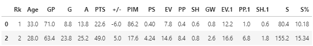
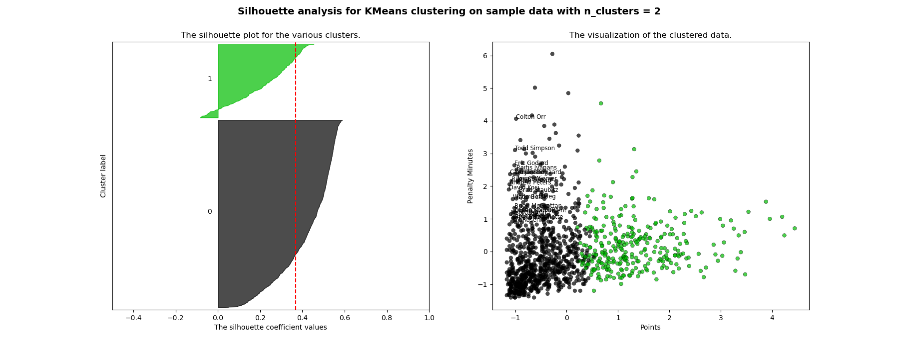
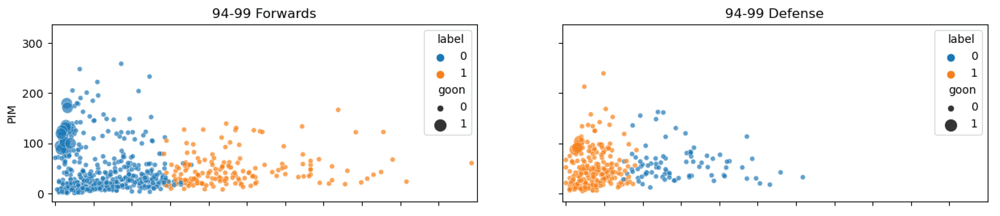
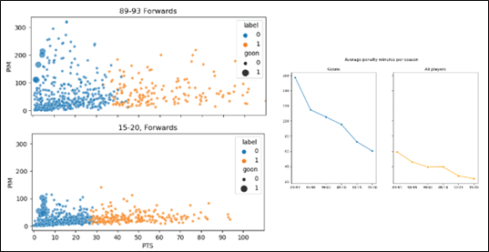
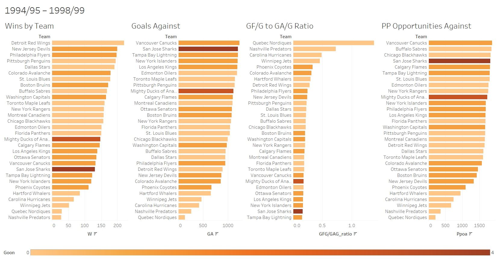
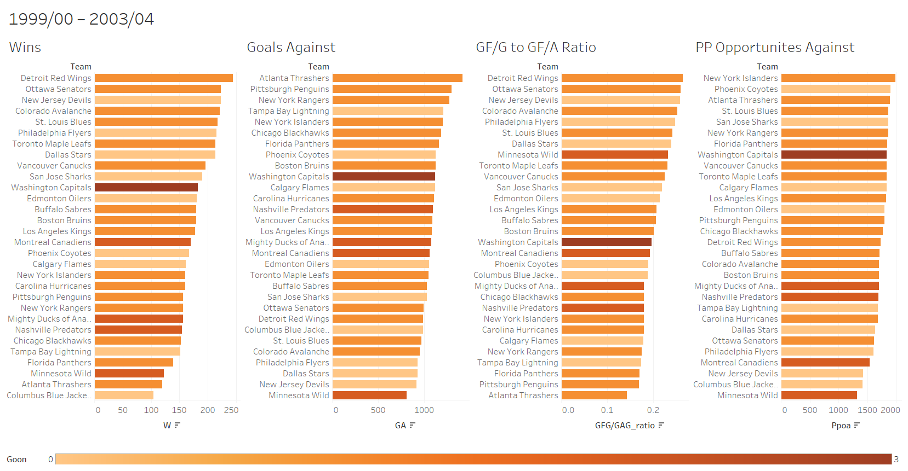
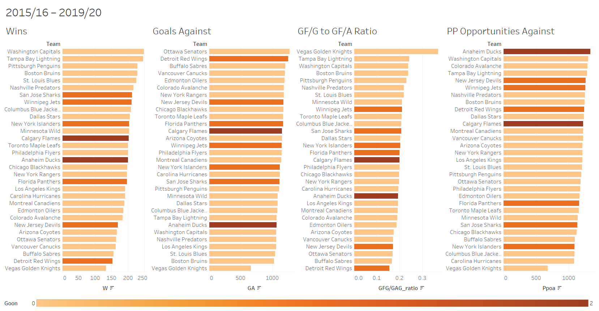

# Clustering Analysis of NHL Players

#### The goal:
* Determine if "goons" were ever a big enough presence to be a distinct cluster
* Compare outcomes of all teams to see if having more goons on a team can lead to success

#### The tools:
* Python
* pandas
* K-means clustering through sklearn
* Principal Components Analysis (PCA)
* Data visualization
    * Seaborn
    * Matplotlib
    * Tableau

### Introduction
For many decades, hockey experts and fans have stated that physical and aggressive players known as “goons” or “enforcers” were a critical element of successful teams in the National Hockey League (NHL). Goons are defined by their physical playstyle that includes hard hits and fighting while usually not contributing to their team’s offensive output. After the cancellation of the 2004/2005 NHL season due to a lockout, significant changes were made to NHL rules that placed more emphasis on skill and speed while trying to limit the more physical aspects of the game. It is often said that after these rule changes there was no longer a place for goons in the NHL. Through the use of K-Means clustering, the goal of this paper is to examine if goons were ever a large enough presence to be detectable as their own unique playstyle and examine if there is a relationship between successful teams and the number of goons on their rosters.

### The Data
All data for this project was collected from [hockey-reference.com](https://www.hockey-reference.com). Seasons were analyzed in batches of five seasons. Those seasons are:

* 1989/1990 – 1993/1994
* 1994/1995 – 1998/1999
* 1999/2000 – 2003/2004
* **2004/2005 season cancelled due to a lockout**
* 2005/2006 – 2009/2010
* 2010/2011 – 2014/2015
* 2015/2016 – 2019/2020

### Preprocessing
Before any clustering was performed the data had to be prepared from its raw form. The statistics tracked by the NHL changed over time so to make an accurate comparison between players and teams I restricted the data to only the columns that were available in every season. Additionally, I dropped the bottom 25% of players by games played before conducting any analysis to eliminate players that only played a few games at the NHL level.

Although the number of hits a player has each year is a factor in what makes a goon, the NHL did not start tracking this statistic until the 2006/07 season. As a result, I defined a goon as a player that is in the top 15% of penalty minutes and the bottom 15% of points (the number of goals and assists combined).

### Clustering
After preprocessing the data, I tried numerous iterations of K-Means clustering to determine the optimal number of clusters for each era. The number of clusters tried ranged from two to six and each number of clusters was also tried with and without Principal Component Analysis (PCA) being performed on the data. Additionally, the same method was applied to offensive and defensive players separately by era for a total of 36 iterations of clustering.

After examining the silhouette scores, the optimal number of clusters for each iteration of clustering was the same at two clusters. The silhouette scores were also better when PCA was performed on the data prior to clustering. Due to the silhouette scores being highest for the clusters where offensive and defensive players were plotted separately, that was the final model I decided to proceed with.

### Replotting After Clustering
After conducting K-Means clustering on each batch of data, the resulting labels were attached to each player and then used to plot in an easily interpretable space. With the main statistics of interest for goons being *penalty minutes* and *points*, each era was plotted with points on the x-axis and penalty minutes on the y-axis. Cluster labels were used to encode color and size was used to indicate which points were players labelled as goons.

### Results
#### Pre-Rule Change
After looking at the plots of penalty minutes and points by era and position, it was clear that the game had changed substantially after the 2005 rule changes. In regards to penalty minutes, in the era from 1989 to 1993, a large number of players accrued more than 150 penalty minutes but during the most recent era only a few players had more than 150 penalty minutes.

In addition to looking at the relationship between penalty minutes and points, I also compared the outcomes of teams that had goons to those that did not. When comparing teams by the number of games they won, teams with the most goons tended to not perform very well and were often in the bottom 50% of teams. This could be in part due to the fact that goons accruing large amounts of penalty minutes leading to their opponents getting more powerplay opportunities.

The San Jose Sharks from 1994-1999 are a good illustration of this. In this era the Sharks were 22nd out of 30 teams in terms of wins, had the second worst *goals against total*, allowed the fourth most *powerplay opportunities against*, and were second to last in *goals for per game/goals against per game ratio*.

The lead up to the 2005 rule changes appears to have been the prime era for goons with 21 of the 30 teams employing at least one goon on their roster. It is worth noting that although over two thirds of teams had goons on their rosters, three of the top eight teams had no goons and the remaining five only had one. Part of what contributed to these higher win totals was having fewer goals scored against them. In fig 6 we can see that three of the best four teams by goals against can from teams that had no goons on their roster.

#### Post Rule Change
After the rule changes of 2005, teams without goons tended to perform better than teams with goons on their squads. The change was gradual with two of the top four teams employing goons between 2005 and 2010, one of the top four between 2010 and 2015, and none of the top four between 2015 and 2020. Similarly, the same trend can be seen in the *goals for per game to goals against per game* statistic with all of the top eight teams having a goon-free roster.

### Conclusion
In conclusion, based on the 30 seasons of data analyzed as part of this project, it appears as though there was a time where having goons on a team could potentially lead to more wins but that time was before the rule changes that came about after the cancelled 2004/2005 season. Following the rule changes, teams were taking far fewer penalties as the new rules encouraged speed and skill over hard hits and physical playstyles. These changes can be seen when examining penalty minutes against points for players throughout the eras. Between 1989 and 1994 there is a wide spread in both penalty minutes and points that gets much tighter after the 2005 rule changes.
In addition to spread of players getting much tighter following the 2004 lockout, between 2010 and 2020, all but one of the top six teams did not have a goon on their roster. The Pittsburgh Penguins between 2010 and 2015 were the one exception to this rule and they only had one goon on their team. This seems to be an indicator that teams that focus on limiting powerplay opportunities for their opponents by staying out of the penalty box are more likely to be successful in the modern NHL.
It is worth noting that even during the eras when goons were more prevalent in the league, the teams that only had one or two in their lineups tended to perform much better than teams that tried to stack their rosters with physical players. Out of the teams that had the most goons on their roster in their era, the 2005 to 2010 Calgary Flames had the most wins in their time and they still only ranked ninth in wins in a 30-team league.