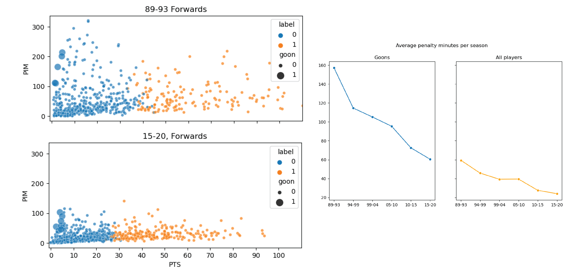

# Clustering Analysis of NHL Players

#### The goal:
* Determine if "goons" were ever a big enough presence to be a distinct cluster
* Compare outcomes of all teams to see if having more goons on a team can lead to success

#### The tools:
* Python
* pandas
* K-means clustering through sklearn
* Principal Components Analysis (PCA)
* Data visualization
    * Seaborn
    * Matplotlib
    * Tableau

### Introduction
For many decades, hockey experts and fans have stated that physical and aggressive players known as “goons” or “enforcers” were a critical element of successful teams in the National Hockey League (NHL). Goons are defined by their physical playstyle that includes hard hits and fighting while usually not contributing to their team’s offensive output. After the cancellation of the 2004/2005 NHL season due to a lockout, significant changes were made to NHL rules that placed more emphasis on skill and speed while trying to limit the more physical aspects of the game. It is often said that after these rule changes there was no longer a place for goons in the NHL. Through the use of K-Means clustering, the goal of this paper is to examine if goons were ever a large enough presence to be detectable as their own unique playstyle and examine if there is a relationship between successful teams and the number of goons on their rosters.

### The Data
All data for this project was collected from [hockey-reference.com](https://www.hockey-reference.com). Seasons were analyzed in batches of five seasons. Those seasons are:

* 1989/1990 – 1993/1994
* 1994/1995 – 1998/1999
* 1999/2000 – 2003/2004
* **2004/2005 season cancelled due to a lockout**
* 2005/2006 – 2009/2010
* 2010/2011 – 2014/2015
* 2015/2016 – 2019/2020

### Preprocessing
Before any clustering was performed the data had to be prepared from its raw form. The statistics tracked by the NHL changed over time so to make an accurate comparison between players and teams I restricted the data to only the columns that were available in every season. Additionally, I dropped the bottom 25% of players by games played before conducting any analysis to eliminate players that only played a few games at the NHL level.

Although the number of hits a player has each year is a factor in what makes a goon, the NHL did not start tracking this statistic until the 2006/07 season. As a result, I defined a goon as a player that is in the top 15% of penalty minutes and the bottom 15% of points (the number of goals and assists combined).

### Clustering
After preprocessing the data, I tried numerous iterations of K-Means clustering to determine the optimal number of clusters for each era. The number of clusters tried ranged from two to six and each number of clusters was also tried with and without Principal Component Analysis (PCA) being performed on the data. Additionally, the same method was applied to offensive and defensive players separately by era for a total of 36 iterations of clustering.

After examining the silhouette scores, the optimal number of clusters for each iteration of clustering was the same at two clusters. The silhouette scores were also better when PCA was performed on the data prior to clustering. Due to the silhouette scores being highest for the clusters where offensive and defensive players were plotted separately, that was the final model I decided to proceed with.

### Replotting After Clustering
After conducting K-Means clustering on each batch of data, the resulting labels were attached to each player and then used to plot in an easily interpretable space. With the main statistics of interest for goons being *penalty minutes* and *points*, each era was plotted with points on the x-axis and penalty minutes on the y-axis. Cluster labels were used to encode color and size was used to indicate which points were players labelled as goons.

